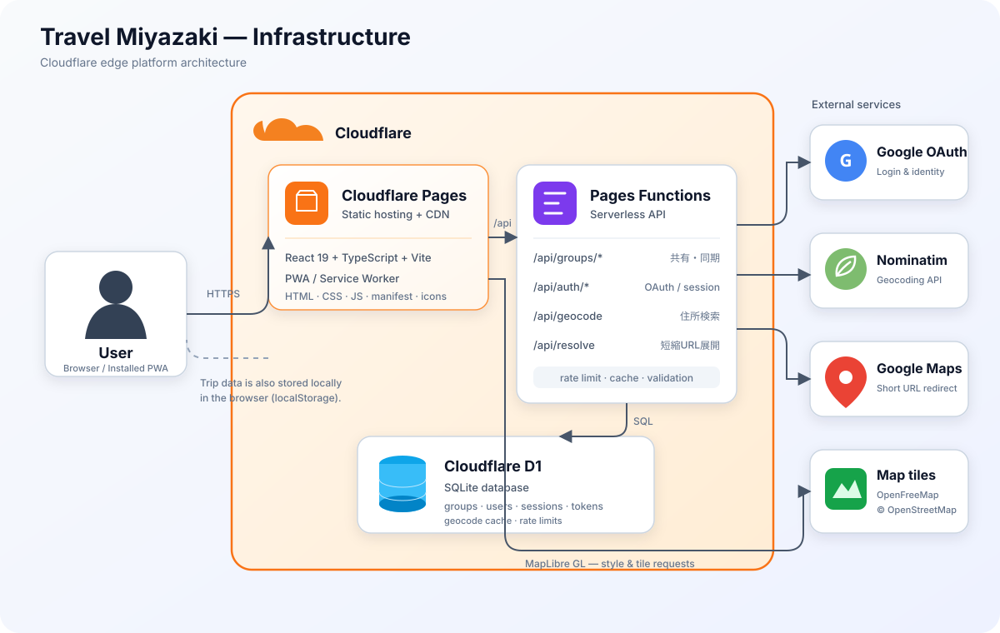

# 旅のしおり

React + TypeScriptで作った、グループ旅行向けのPWAです。予定、地図、予算、立替精算、持ち物、共有メモを一つにまとめます。

## ローカル起動

```bash
npm install
npm run dev
```

本番ビルドは `npm run build`、出力先は `dist` です。

## Cloudflare Pages

- フレームワーク プリセット: `Vite`
- ビルド コマンド: `npm run build`
- ビルド出力ディレクトリ: `dist`
- ルートディレクトリ: `/`

グループ共有にはPagesプロジェクトのD1バインディング `DB` が必要です。初回だけ `schema.sql` をD1へ実行してください。APIは `functions/api/groups/[[path]].ts` です。

Googleアカウント連携を使う場合は、Google Cloud Console の承認済みリダイレクトURIに `https://<本番ドメイン>/api/auth/callback`（ローカルは `http://localhost:5173/api/auth/callback`）を登録します。`GOOGLE_CLIENT_ID` は `wrangler.example.toml` の `[vars]` を参考に設定し、クライアントシークレットは平文の設定ファイルへ置かず、次のコマンドでSecretとして登録してください。

```bash
# Pagesプロジェクトなので `wrangler secret put` ではなく pages 版を使う
wrangler pages secret put GOOGLE_CLIENT_SECRET --project-name travel-miyazaki
```

`GOOGLE_CLIENT_ID` はPagesダッシュボードの Settings → Environment variables でも設定できます。**どちらか一方でも未設定だとログインは動かず、共有ページに「Googleログインがまだ設定されていません」と表示されます。** 設定後は再デプロイが必要です。

## インフラ構成



ブラウザへ配信するReact製PWAとサーバーレスAPIをCloudflare Pages上で動かし、旅行グループ、認証セッション、住所検索キャッシュなどのデータをCloudflare D1へ保存します。地図表示にはOpenFreeMap / OpenStreetMap、住所検索にはNominatim、ログインにはGoogle OAuthを利用しています。

## 主な構成

- `src/` - React画面、状態管理、型定義
- `functions/` - Cloudflare Pages Functions
- `public/` - PWAマニフェスト、Service Worker、アイコン
- `docs/product-roadmap.md` - 機能棚卸しと次の開発候補
