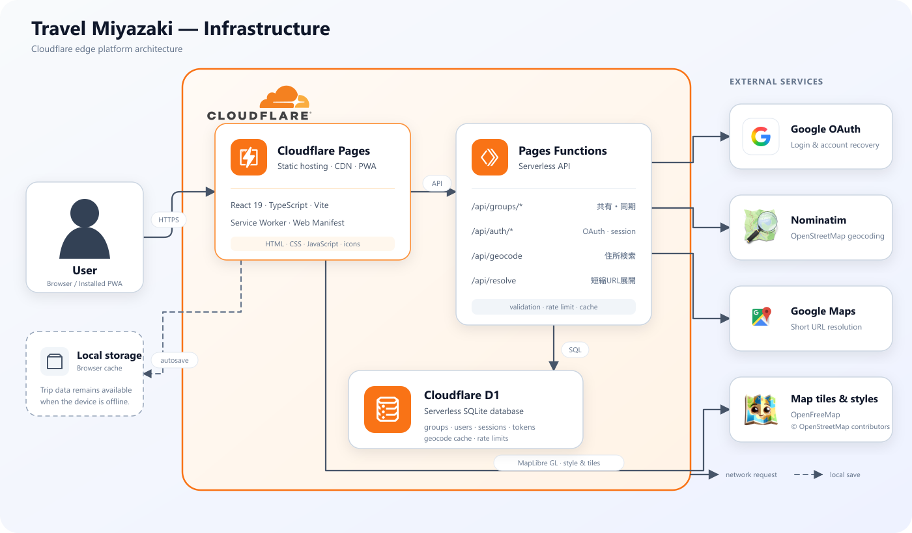

# Tabilog（旅のしおり）

旅行の予定、地図、予算、立替精算、持ち物、写真、共有メモを一つにまとめられる、グループ旅行向けのPWAです。ReactとTypeScriptで構築し、Cloudflare Pages / Pages Functions / D1で配信・同期します。

[デモを見る](https://travel-miyazaki.pages.dev/) · [English](#english)

## 主な機能

- 複数の旅行をチケット形式で作成・管理
- 日ごとの予定、宿泊先、訪問地点、ルートを地図で確認
- 予算、お土産代、立替払い、メンバー別の精算額を自動計算
- グループで使える持ち物チェックリスト、写真アルバム、共有メモ
- 6桁の参加コードによるグループ共有とCloudflare D1への同期
- 任意のGoogleログインによる、別端末での旅行データ復元
- Service WorkerによるPWA対応とオフライン時の端末保存

## 使い方

1. [Tabilog](https://travel-miyazaki.pages.dev/)を開き、「新しい旅を作る」を選びます。
2. 旅行名、日程、出発地、目的地などを設定します。
3. 「予定」「お金」「持ち物」「共有」の各タブへ情報を追加します。
4. 共同編集する場合は「共有」でグループを作り、表示された6桁コードを参加者へ伝えます。
5. 必要に応じてGoogleでログインすると、別の端末から参加中の旅行を復元できます。

Googleログインとグループ共有は、デプロイ先での環境設定が必要です。設定しなくても、データをブラウザ内に保存して基本機能を利用できます。

## インフラ構成

[](docs/infrastructure.svg)

React製PWAとサーバーレスAPIをCloudflare Pages上で動かし、旅行グループ、認証セッション、住所検索キャッシュなどをCloudflare D1へ保存します。地図にはOpenFreeMap / OpenStreetMap、住所検索にはNominatim、ログインにはGoogle OAuthを利用します。

## 技術スタック

| 分類 | 使用技術 |
| --- | --- |
| フロントエンド | React 19、TypeScript、Vite |
| 地図 | MapLibre GL、OpenFreeMap、OpenStreetMap |
| API | Cloudflare Pages Functions |
| データベース | Cloudflare D1 |
| 認証 | Google OAuth 2.0（任意） |
| PWA | Web App Manifest、Service Worker |
| CI / Hosting | GitHub Actions、Cloudflare Pages |

## ローカル開発

### 必要な環境

- Node.js 22.12以上
- npm

### 起動

```bash
git clone https://github.com/isikawatatsuki/Travel_Miyazaki.git
cd Travel_Miyazaki
npm ci
npm run dev
```

Viteの開発サーバーが表示するURLをブラウザで開いてください。フロントエンド単体ではブラウザ内保存を利用できます。D1を使うグループ共有、住所検索API、Googleログインをローカルで検証する場合は、Cloudflare Pages Functionsを実行できる環境も設定してください。

### 利用できるコマンド

| コマンド | 内容 |
| --- | --- |
| `npm run dev` | Vite開発サーバーを起動 |
| `npm run build` | 型チェック後に本番用ファイルを`dist`へ生成 |
| `npm run preview` | 本番ビルドをローカルで確認 |
| `npm run typecheck` | フロントエンドとFunctionsの型を検査 |
| `npm test` | Node.jsのテストを実行 |

## Cloudflare Pagesへのデプロイ

Cloudflare Pagesプロジェクトでは、次のビルド設定を使用します。

| 項目 | 値 |
| --- | --- |
| Framework preset | `Vite` |
| Build command | `npm run build` |
| Build output directory | `dist` |
| Root directory | `/` |

### D1

1. Cloudflare D1データベースを作成します。
2. [`schema.sql`](schema.sql)を初回だけ実行します。
3. Pagesプロジェクトへ、変数名`DB`でD1データベースをバインドします。

設定例は[`wrangler.example.toml`](wrangler.example.toml)を参照してください。グループ共有APIは[`functions/api/groups/[[path]].ts`](functions/api/groups/[[path]].ts)にあります。

### Google OAuth（任意）

1. Google Cloud ConsoleでOAuthクライアントを作成します。
2. 承認済みリダイレクトURIへ`https://<本番ドメイン>/api/auth/callback`を登録します。ローカルでは`http://localhost:5173/api/auth/callback`を使用します。
3. Pagesの環境変数へ`GOOGLE_CLIENT_ID`を設定します。
4. クライアントシークレットを、平文ファイルではなくSecretとして登録します。

```bash
wrangler pages secret put GOOGLE_CLIENT_SECRET --project-name travel-miyazaki
```

`GOOGLE_CLIENT_ID`または`GOOGLE_CLIENT_SECRET`が未設定の場合、Googleログインは利用できません。設定後はPagesを再デプロイしてください。

## ディレクトリ構成

```text
Travel_Miyazaki/
├─ src/          # Reactの画面、コンポーネント、状態管理、型定義
├─ functions/    # Cloudflare Pages Functions
├─ public/       # PWAマニフェスト、Service Worker、アイコン
├─ docs/         # 構成図、仕様、ロードマップ、セキュリティ情報
├─ schema.sql    # Cloudflare D1のスキーマ
└─ package.json  # 依存関係とnpm scripts
```

関連資料：[`docs/product-roadmap.md`](docs/product-roadmap.md) · [`docs/SECURITY.md`](docs/SECURITY.md) · [`docs/travel-tickets.md`](docs/travel-tickets.md)

---

<a id="english"></a>

## English

Tabilog is a progressive web app for planning group trips. It keeps itineraries, maps, budgets, shared expenses, packing lists, photos, and notes in one place. The app is built with React and TypeScript and runs on Cloudflare Pages, Pages Functions, and D1.

[Open the live app](https://travel-miyazaki.pages.dev/) · [日本語](#tabilog旅のしおり)

### Features

- Create and manage multiple trips as travel tickets
- Organize daily schedules, stays, places, and routes on a map
- Calculate budgets, souvenir costs, shared payments, and settlements
- Share packing lists, photo albums, and notes with the group
- Sync a group through Cloudflare D1 using a six-digit join code
- Optionally sign in with Google to restore trips on another device
- Install the app as a PWA and retain local data while offline

### Getting started

1. Open [Tabilog](https://travel-miyazaki.pages.dev/) and select “新しい旅を作る” (Create a new trip).
2. Enter the trip name, dates, origin, destination, and other details.
3. Add information from the Schedule, Money, Packing, and Share tabs.
4. To collaborate, create a group from the Share tab and send the six-digit code to the other travelers.
5. Optionally sign in with Google to restore joined trips on another device.

Group sync and Google sign-in require environment configuration on the deployment. Without them, the core features still work using browser-local storage.

### Architecture

The architecture diagram is shown in the [Japanese section](#インフラ構成). The React PWA and serverless API run on Cloudflare Pages. Cloudflare D1 stores groups, authentication sessions, and geocoding cache data. Maps use OpenFreeMap / OpenStreetMap, geocoding uses Nominatim, and authentication uses Google OAuth.

### Tech stack

| Area | Technology |
| --- | --- |
| Frontend | React 19, TypeScript, Vite |
| Maps | MapLibre GL, OpenFreeMap, OpenStreetMap |
| API | Cloudflare Pages Functions |
| Database | Cloudflare D1 |
| Authentication | Google OAuth 2.0 (optional) |
| PWA | Web App Manifest, Service Worker |
| CI / Hosting | GitHub Actions, Cloudflare Pages |

### Local development

Node.js 22.12 or later and npm are required.

```bash
git clone https://github.com/isikawatatsuki/Travel_Miyazaki.git
cd Travel_Miyazaki
npm ci
npm run dev
```

Open the URL printed by Vite. The frontend can use browser-local storage by itself. Testing D1-backed group sharing, the geocoding API, or Google sign-in locally also requires an environment capable of running Cloudflare Pages Functions.

| Command | Description |
| --- | --- |
| `npm run dev` | Start the Vite development server |
| `npm run build` | Type-check and create a production build in `dist` |
| `npm run preview` | Preview the production build locally |
| `npm run typecheck` | Type-check the frontend and Pages Functions |
| `npm test` | Run the Node.js test suite |

### Deploying to Cloudflare Pages

Use `Vite` as the framework preset, `npm run build` as the build command, `dist` as the output directory, and `/` as the root directory.

For group sharing, create a D1 database, apply [`schema.sql`](schema.sql), and bind it to the Pages project as `DB`. See [`wrangler.example.toml`](wrangler.example.toml) for an example.

For optional Google sign-in, register `https://<production-domain>/api/auth/callback` as an authorized redirect URI (`http://localhost:5173/api/auth/callback` for local development), set `GOOGLE_CLIENT_ID`, and store the client secret securely:

```bash
wrangler pages secret put GOOGLE_CLIENT_SECRET --project-name travel-miyazaki
```

Redeploy the Pages project after changing environment variables or secrets.

### Project structure

```text
Travel_Miyazaki/
├─ src/          # React pages, components, state, and types
├─ functions/    # Cloudflare Pages Functions
├─ public/       # PWA manifest, Service Worker, and icons
├─ docs/         # Architecture, specifications, roadmap, and security notes
├─ schema.sql    # Cloudflare D1 schema
└─ package.json  # Dependencies and npm scripts
```

Further reading: [`docs/product-roadmap.md`](docs/product-roadmap.md) · [`docs/SECURITY.md`](docs/SECURITY.md) · [`docs/travel-tickets.md`](docs/travel-tickets.md)
